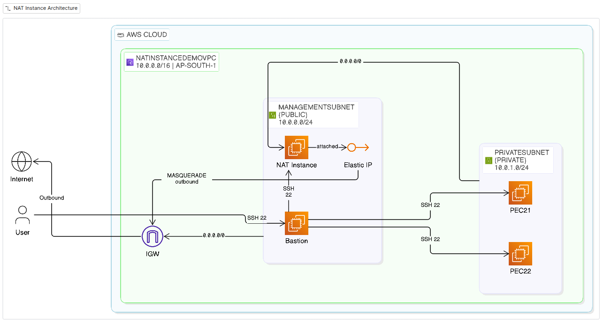

# NAT Instance Setup in AWS (Terraform)

A cost-effective alternative to AWS's managed NAT Gateway, built using a regular EC2 instance configured to do NAT via iptables. This is a learning project for a larger infrastructure project.

## Architecture



- **VPC**: `NatInstanceDemoVPC` (`10.0.0.0/16`) in `ap-south-1`
- **ManagementSubnet** (`10.0.0.0/24`, public, routed to IGW): hosts the Bastion and NAT instance
- **PrivateSubnet** (`10.0.1.0/24`, private, routed to the NAT instance's ENI): hosts `PEC21` and `PEC22`
- **Bastion**: public IP, SSH allowed only from a configured trusted IP (`var.my_public_ip`)
- **NAT Instance**: `source_dest_check` disabled, Elastic IP attached, runs iptables MASQUERADE for outbound traffic from the private subnet, SSH allowed only from the bastion
- **PEC21 / PEC22**: no public IP, SSH allowed only from the bastion

## Expected Outcomes (success)

1. 1 NAT instance in the public subnet with a public IP
2. 1 Bastion instance in the public subnet with a public IP
3. 2 instances in the private subnet without a public IP
4. Internet connectivity for the private instances, routed through the NAT instance

## Repo Structure

```
aws-infra/
├── ami.tf          # Ubuntu
├── ec2s.tf         # Bastion, NAT instance, PEC21, PEC22 + user_data scripts
├── main.tf         # provider config + outputs (IPs)
├── outputs.tf      # output values for IPs
├── rts.tf          # route tables (to_igw, to_nat_instance)
├── sgs.tf          # security groups
├── ssh-keys.tf     # tls_private_key + aws_key_pair + local key files
├── subnets.tf      # ManagementSubnet, PrivateSubnet + RT associations
├── terraform.tf    # required_providers + required_version
├── vars.tf         # region, my_public_ip
└── vpc.tf          # VPC + Internet Gateway
```

## Usage

```bash
<clone this repo and cd into it>
cd aws-infra
terraform init
cp sample.env .env
nano .env # edit .env to add your values
set -a
source .env
terraform plan -out plan.tfplan
terraform apply plan.tfplan
```

SSH into the bastion using the generated key in `aws-infra/.ssh/`:

```bash
ssh -i aws-infra/.ssh/bastion_key_pair.pem ubuntu@<bastion_public_ip>
```

And then manually copy the management key into the bastion.

After that, from the bastion, hop into the private instances using the management key:

```bash
ssh -i aws-infra/.ssh/management_key_pair.pem ubuntu@<PEC21_or_PEC22_private_ip>
```

Now check for internet connectivity.

## Notes

- The NAT instance is intentionally a plain EC2 instance, not a managed NAT Gateway, to demonstrate the underlying mechanism (`ip_forward` + iptables `MASQUERADE`) at lower cost.
- `source_dest_check` is disabled on the NAT instance since it needs to forward traffic that isn't addressed to itself.
- Private key files are written locally via `local_file` and are not committed (see `.gitignore`).

## NAT instance user_data

Probably what you are looking to copy paste

```bash
#!/bin/bash
apt-get update
apt-get upgrade -y

set -eux

export DEBIAN_FRONTEND=noninteractive

echo iptables-persistent iptables-persistent/autosave_v4 boolean true | debconf-set-selections
echo iptables-persistent iptables-persistent/autosave_v6 boolean true | debconf-set-selections

apt-get install -y iptables-persistent

sysctl -w net.ipv4.ip_forward=1
echo "net.ipv4.ip_forward=1" > /etc/sysctl.d/99-nat.conf

PRIMARY_IFACE=$(ip route | awk '/default/ {print $5; exit}')

iptables -t nat -A POSTROUTING -o "$PRIMARY_IFACE" -j MASQUERADE
iptables -A FORWARD -i "$PRIMARY_IFACE" -m state --state RELATED,ESTABLISHED -j ACCEPT
iptables -A FORWARD -o "$PRIMARY_IFACE" -j ACCEPT

netfilter-persistent save
```
